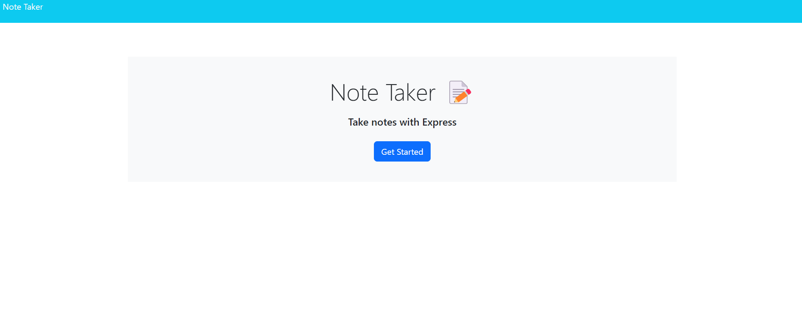

# Note Taker Application

## Description

This application provides an easy experience to save, update, or delete notes for future use. I actually use this at work to get action items from meetings easier.

## Installation

To use this application on your local machine, please run '$ npm i' in the terminal to install all necessary packages

## Usage

## Credits

Worked with Christin Carter and Josh Taylor, a few classmates of mine

## License

N/A

## Contact for Questions

Email me at: thefiftharthur@gmail.com
GitHub Profile: https://github.com/artiecannv

## Deployed URL

https://arthur-note-taker.herokuapp.com/
